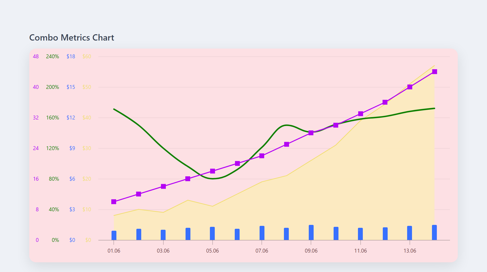
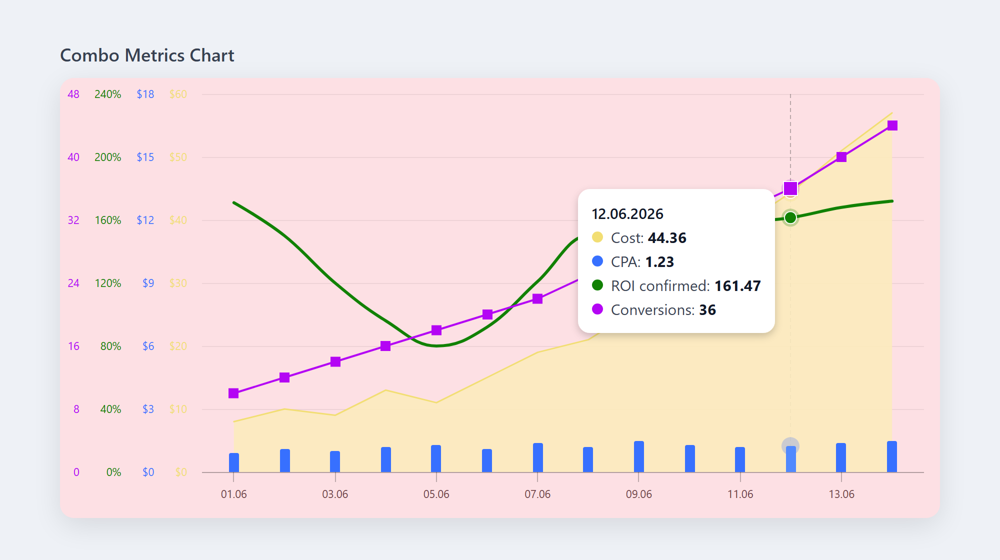

# Combo Metrics Chart

**English** | [Русский](README.ru.md)

A combined time-series chart that renders **four sequences**, each as a different
series type — replicating the styling and hover behaviour of the reference design:

| Sequence        | Series type | Color                |
| --------------- | ----------- | -------------------- |
| `Cost`          | **area**    | yellow               |
| `ROI confirmed` | **spline**  | green                |
| `Conversions`   | **line**    | magenta (□ markers)  |
| `CPA`           | **column**  | blue                 |

Built with **Highcharts + React + TypeScript + Vite**.



_Shared tooltip + crosshair on hover:_



### What it reproduces from the reference

- Four series of different types on one plot (area / spline / line / column).
- A **separate Y axis per series**, so different units never collide
  (`$` for Cost/CPA, `%` for ROI, plain count for Conversions).
- **Shared tooltip** — white rounded card with a date header (`DD.MM.YYYY`) and a
  colored bullet + value per series.
- **Crosshair**, hover **halo** on the active point, square markers on the line.
- Rose plot background and soft entrance animation.

---

## Requirements

- [Node.js](https://nodejs.org/) **18+** (developed on Node 24)
- npm (ships with Node)

## Getting started

```bash
# 1. install dependencies
npm install

# 2. start the dev server (http://localhost:5173)
npm run dev
```

Other scripts:

```bash
npm run build      # type-check + production build into dist/
npm run preview    # serve the production build locally
npm run typecheck  # type-check only
```

> **Tip:** the chart shows four stacked Y-axis label columns on the left, so it
> looks best at a desktop width (≈ 600 px or wider). The page is capped at 880 px.

---

## Initialize with four data sequences

The chart is driven by a single `ChartData` object (see
[`src/types.ts`](src/types.ts)):

```ts
export interface ChartData {
  dates: string[];         // ISO 'YYYY-MM-DD', shared by all series
  series: SeriesConfig[];  // the four sequences
}

export interface SeriesConfig {
  name: string;                              // shown in the tooltip, e.g. "Cost"
  type: 'area' | 'spline' | 'line' | 'column';
  color: string;                             // hex color
  data: number[];                            // index-aligned with `dates`
  axisFormat?: string;                       // e.g. '${value}', '{value}%', '{value}'
  tooltipDecimals?: number;                  // default 2
  axisMax?: number;                          // fixed Y-axis max — keeps a series small
                                             // (e.g. short column bars), default auto
}
```

The fastest way to plug in your own data is to edit
[`src/data.ts`](src/data.ts) (or build the object anywhere and pass it in):

```ts
import type { ChartData } from './types';

export const sampleData: ChartData = {
  dates: ['2026-06-01', '2026-06-02', '2026-06-03', '2026-06-04'],
  series: [
    { name: 'Cost',          type: 'area',   color: '#f2de73', axisFormat: '${value}', tooltipDecimals: 2, data: [8, 13, 26, 44.36] },
    { name: 'CPA',           type: 'column', color: '#3770ff', axisFormat: '${value}', tooltipDecimals: 2, axisMax: 18, data: [0.9, 1.2, 1.5, 1.23] },
    { name: 'ROI confirmed', type: 'spline', color: '#118103', axisFormat: '{value}%', tooltipDecimals: 2, data: [171, 96, 141, 161.47] },
    { name: 'Conversions',   type: 'line',   color: '#b405f4', axisFormat: '{value}',  tooltipDecimals: 0, data: [10, 16, 28, 36] },
  ],
};
```

Then render the component with that data:

```tsx
import ComboChart from './ComboChart';
import { sampleData } from './data';

export default function App() {
  return <ComboChart data={sampleData} height={440} />;
}
```

### Rules of thumb

- **Keep four series**, one of each type (`area`, `spline`, `line`, `column`) to
  match the reference. (Technically any number/type works — the component maps
  each entry to its own axis and renders accordingly.)
- Every series' `data` array must be **the same length as `dates`** and aligned
  by index.
- `axisFormat` is a [Highcharts label format string](https://api.highcharts.com/highcharts/yAxis.labels.format)
  — use `${value}` for money, `{value}%` for percent, `{value}` for plain numbers.
- `color` drives the line/fill, the marker and the tooltip bullet at once.

---

## Project structure

```
src/
  main.tsx        # React entry point
  App.tsx         # mounts <ComboChart /> with the sample data
  ComboChart.tsx  # builds the Highcharts options (styling + behaviour)
  data.ts         # the four sample sequences — edit this to feed real data
  types.ts        # ChartData / SeriesConfig contracts
  index.css       # page + card layout
```

## Notes

- Surrounding app chrome from the original screenshot (the `Tdy` corner label and
  the edit-pencil button) is host-application UI and is intentionally out of scope —
  this project focuses on the chart widget itself.
- Highcharts is free for personal, evaluation and non-commercial use; a commercial
  license is required for commercial products. See <https://shop.highcharts.com/>.
